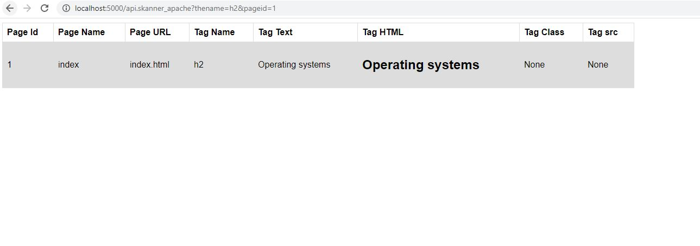
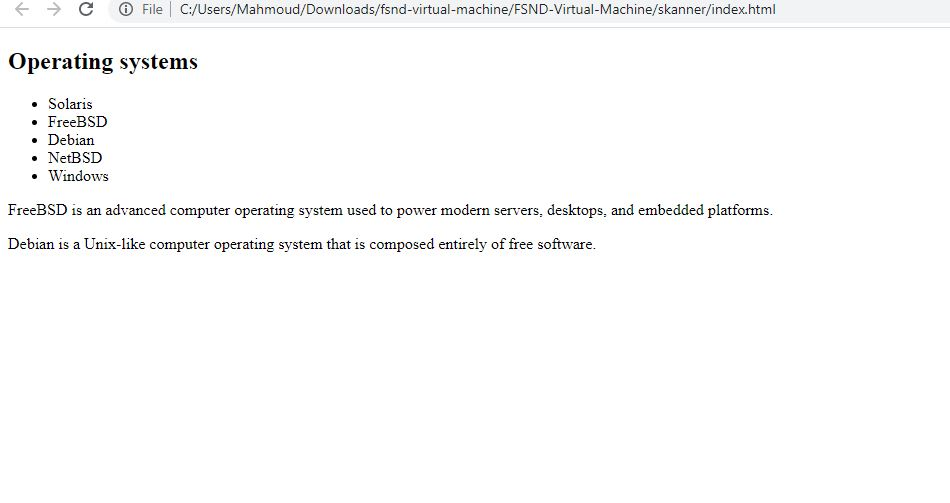
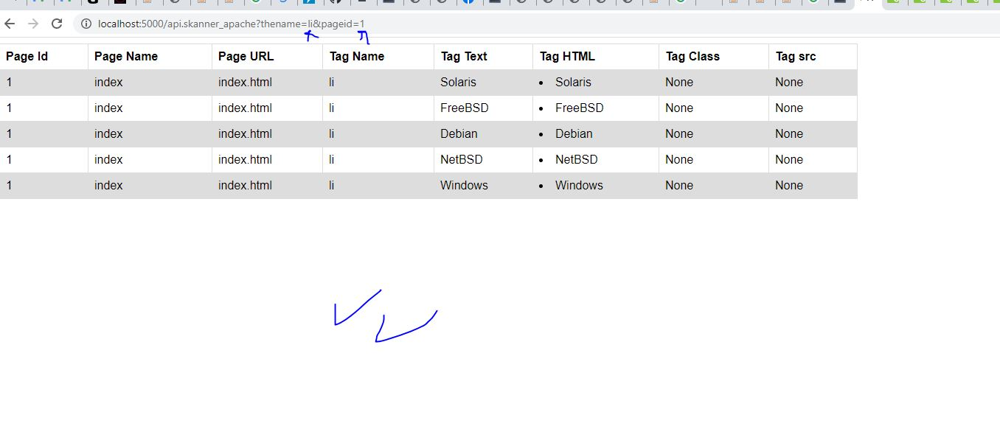
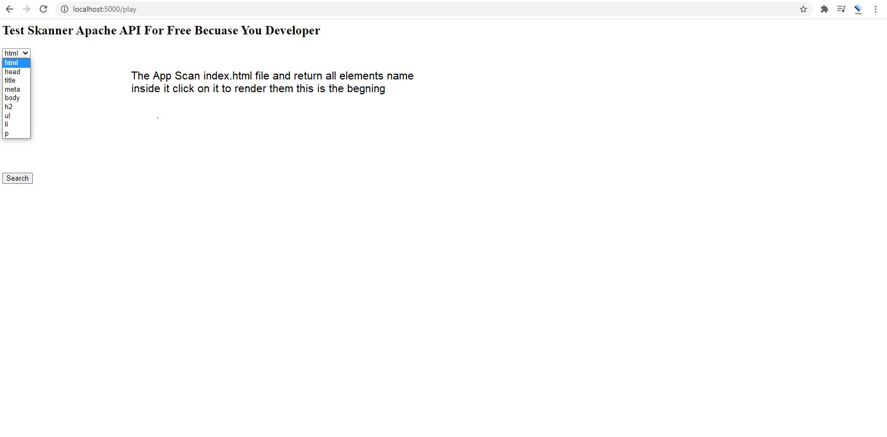
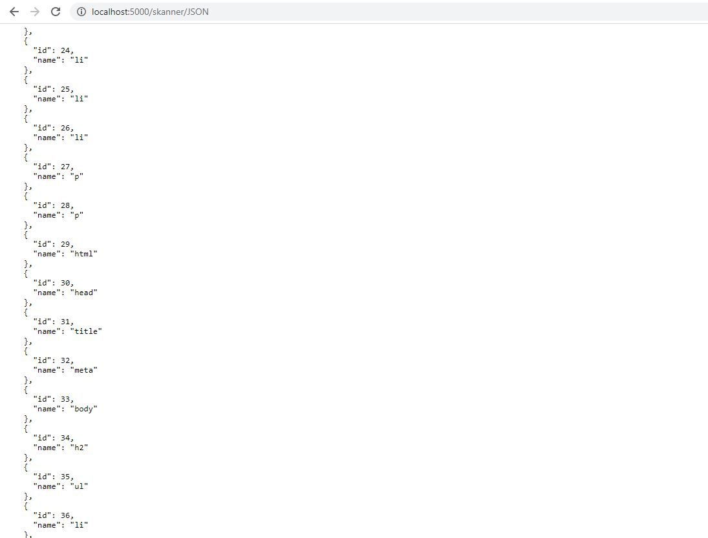
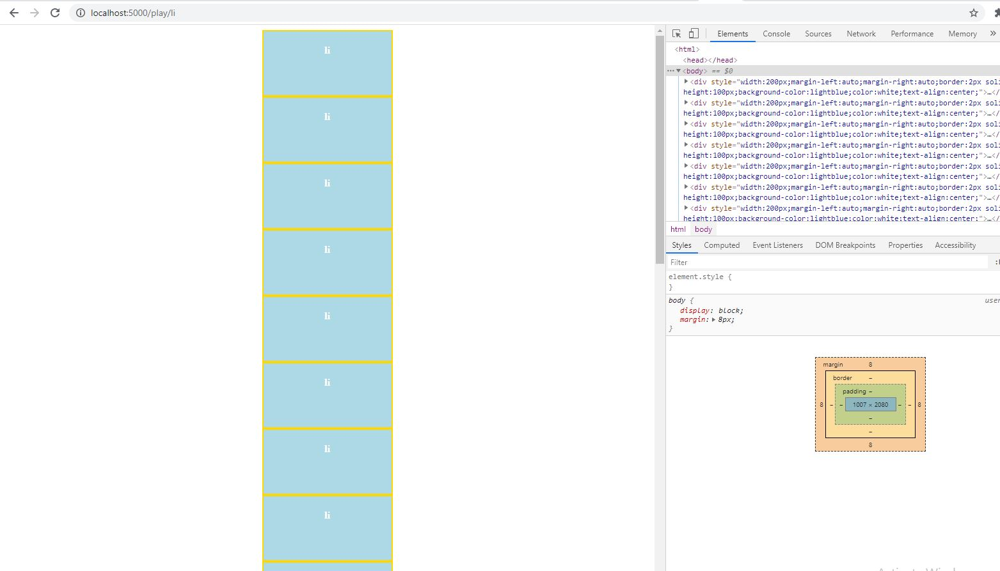
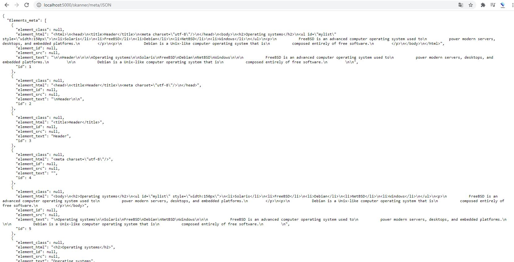
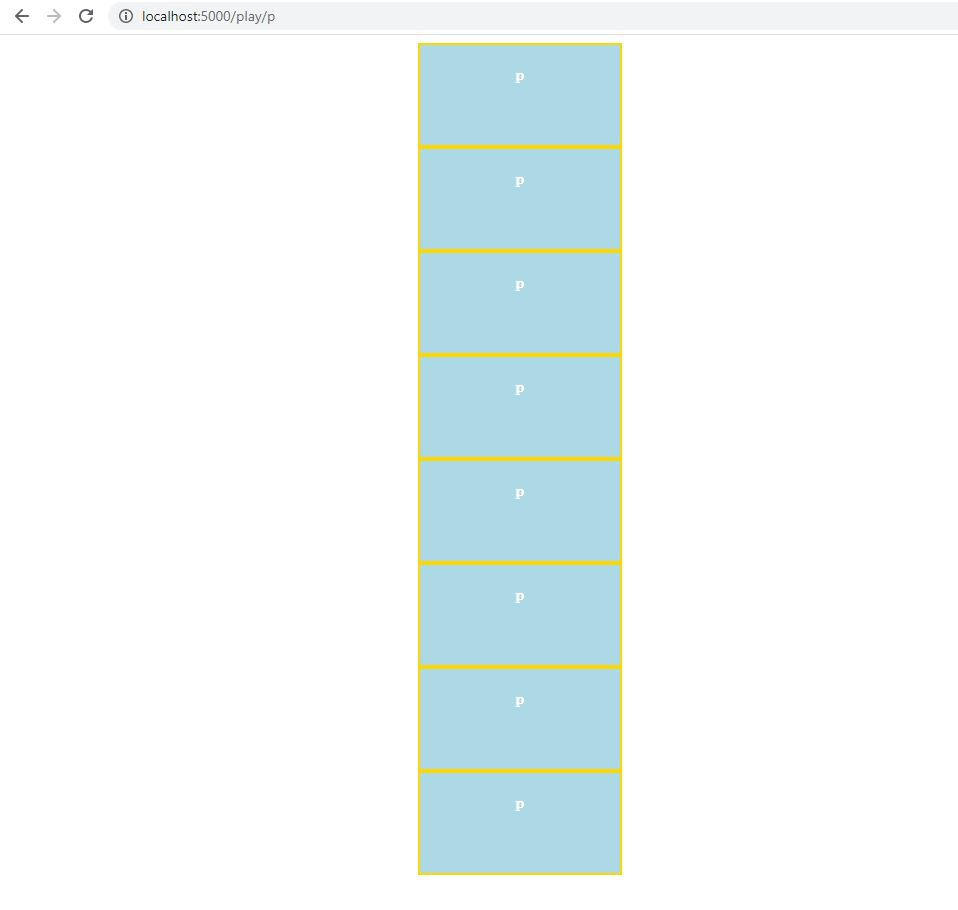

# skanner_apache restful API and web services
1. web scraping, 
2. API integrate
3. scan excel
4. automated test
5. reports
6. upload multi pages using test file or get request

# why i need it
1- I have alot of website need scrap them and test some values or data and create reports with check in one app can integrate with
. or download excelsheet or display any report according to advanced search and alot of options
2- you have excelsheet need extract some values

3- you need scrap some only link and get the data (but only website alow web scraping for now)
4- advanced data anlasyis
5- append the data to database, get JSON end point, restful api respond to get requests on /play
6- you can use alot of parameters to control what data you need 

# how it work

1- the app get the url
2- using beatfulsoup then start parse the document in adnvaced way
3- then append the data in professional relational database and easy orginze way
4- then control what data you need from which page also submit get request to api /play to get the data remotely or send your file url
   

# apache_scanner 2.0.1

# apache_scanner 1.0.2

# old

# others
* Restful API, path url for it if the server allow the scrap the skanner_apache will extract the elements and append to it's database and it's end point api, you can play and * *  * search for specific data using this URL http://localhost:5000/play/li 
* for example this will return all li , this is the start of 
* the app it will parse the document and get the images or elements with class 
* it will provide end point JSON API to share the data with other apps and you can ask for specific export to excelshet  
